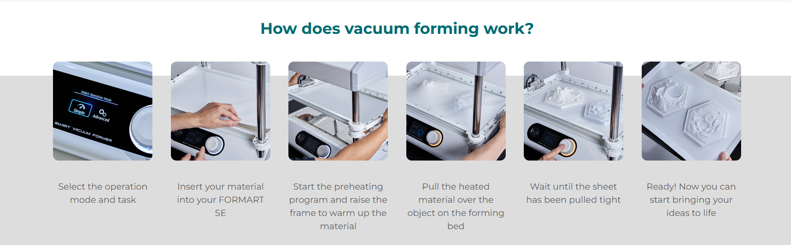
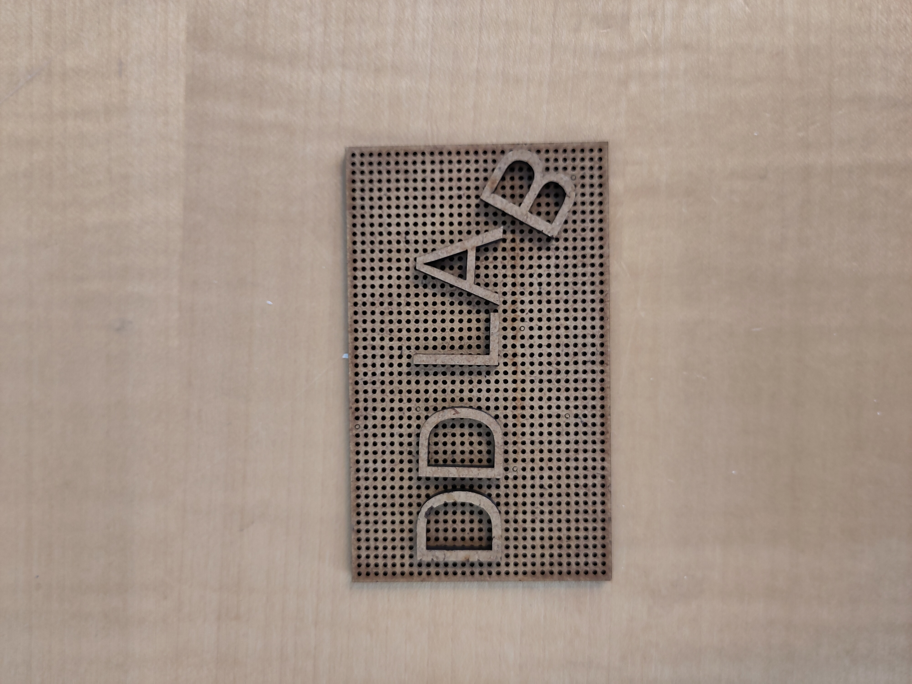
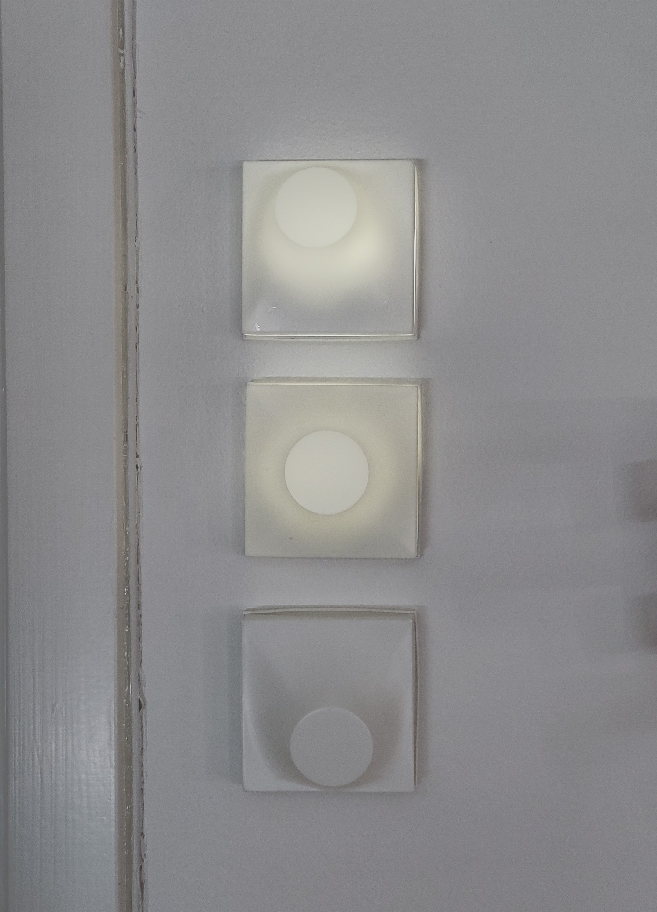
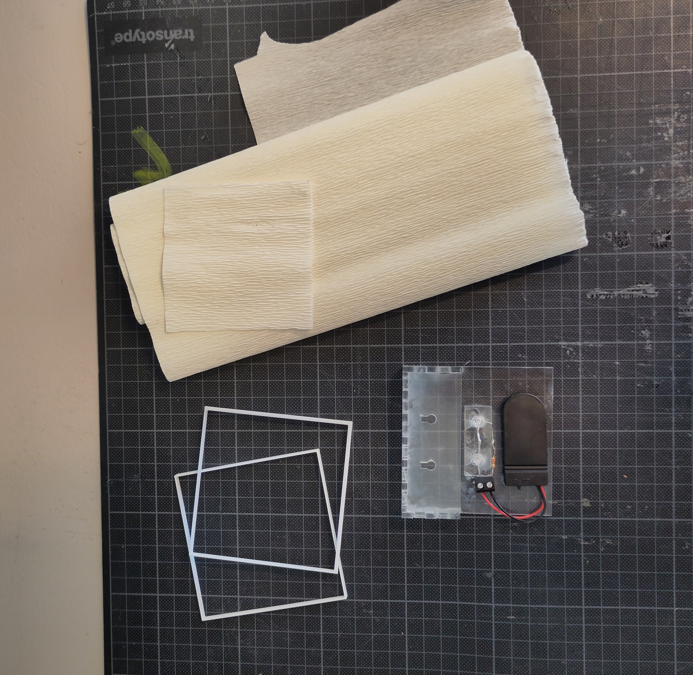
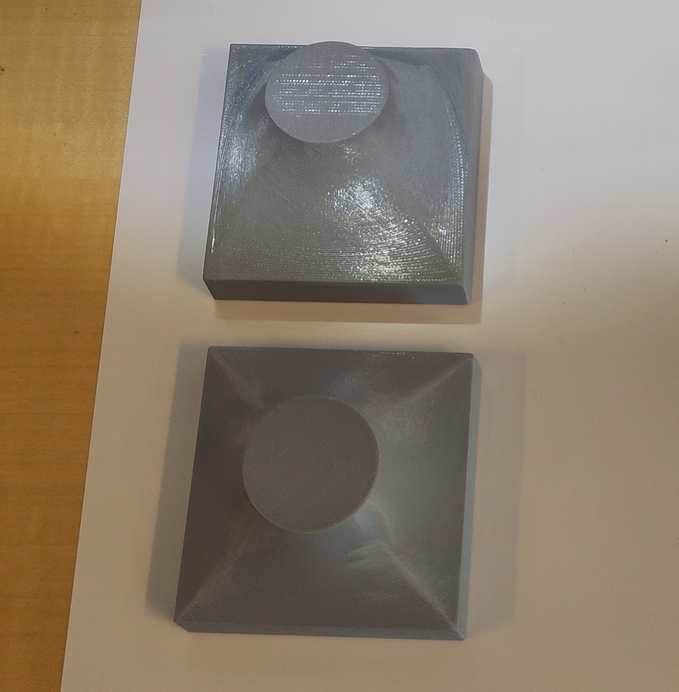
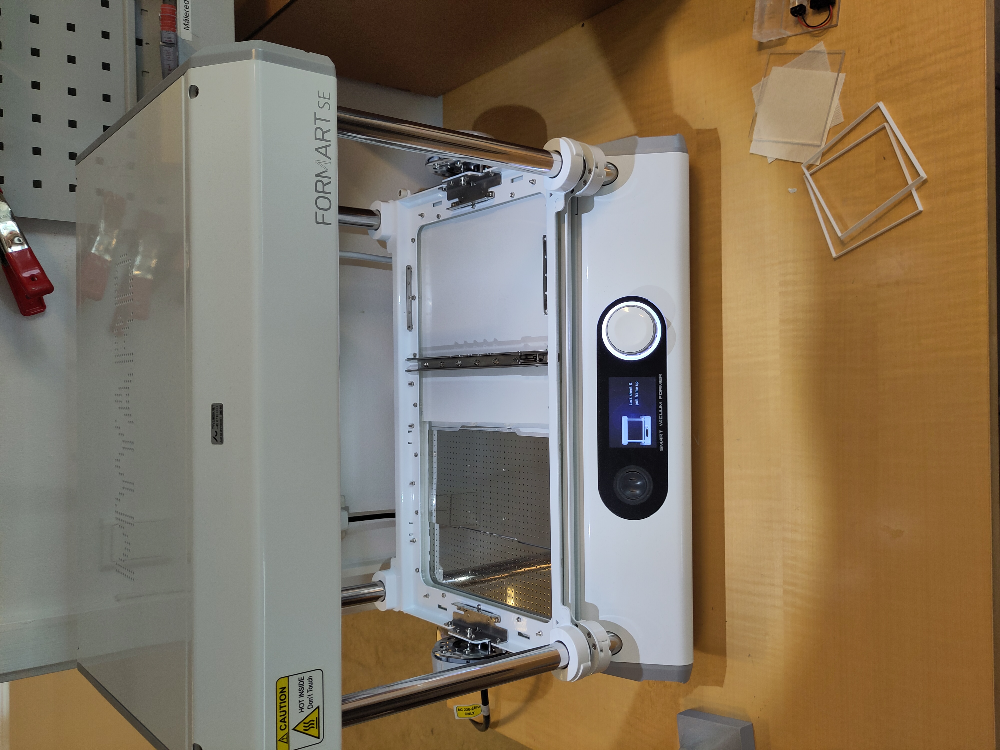
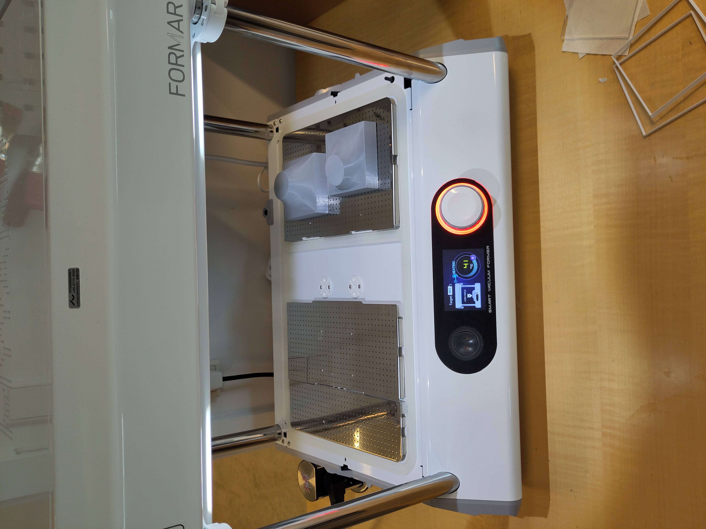
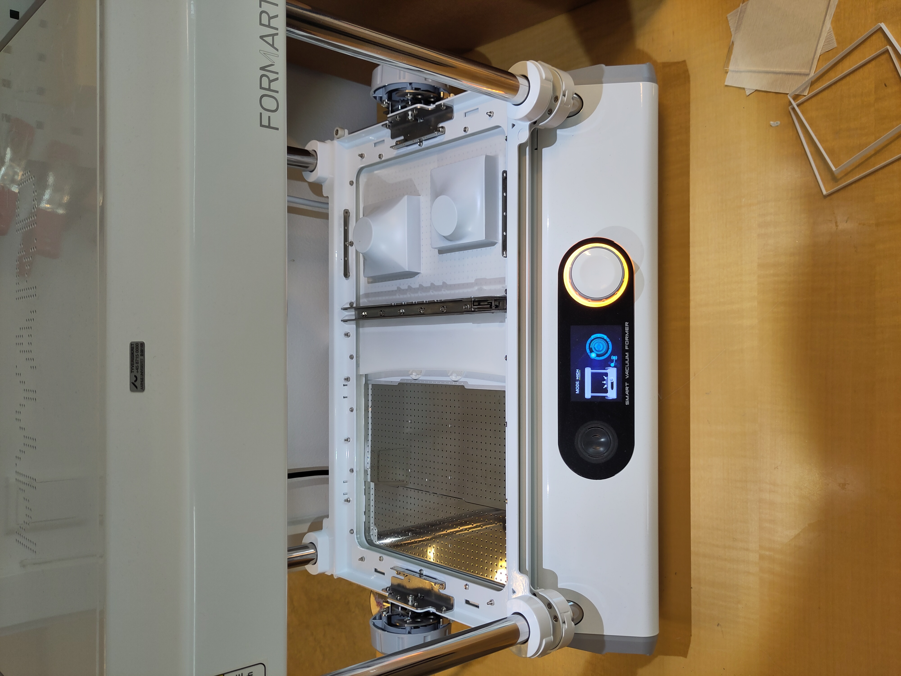
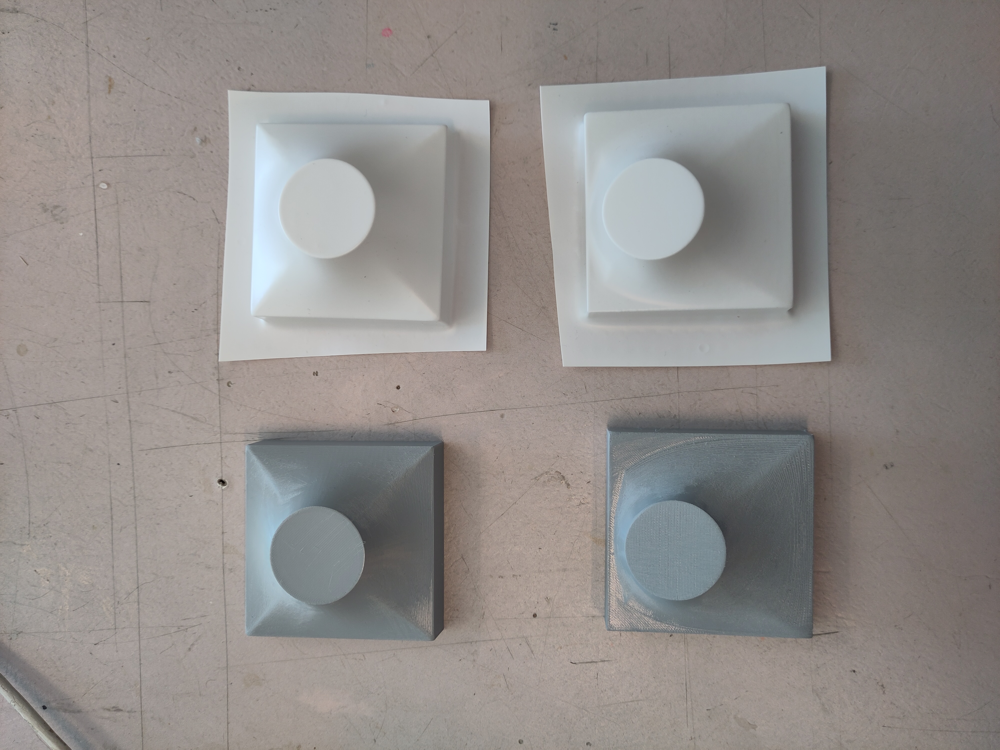

# Guide til Formart SE vakuumformer

## Indhold

1. [Guide til FORMART SE](#guide-til-formart-se)
2. [Forme til at vakuumforme](#forme-til-at-vakuumforme)
3. [Eksempel projekt](#eksempel-projekt)

**TLDR:** Link til officiel guide [her](https://www.youtube.com/watch?v=s0XORjr9Ifk).

## Guide til FORMART SE

### Indhold

1. [Materialer](#materialer)
2. [Ekstraudstyr](#ekstra-udstyr)
3. [step-by-step](#step)

### TBA

#### Materialer

#### Ekstra udstyr

## Forme til at vakuumforme

Man kan lave en form til at vakuumforme på flere måder. Enten ved at støbe over et allerede eksisterende objekt, eller ved at lave en form selv. I DDlab har vi materialer til at lave forme af træ, ler og med 3D print.

Når man laver en form er der flere parametre, man skal overveje:

1. **Draft Angle**

	Vinklen, siderne på formen har, afgør om man kan skille formen fra emnet, efter man har vakuumformet over den. Huskereglen er, at lodrette sider skal have en vinkel på 3–6 grader.

	

2. **Underhæng**

	Underhæng er, hvis toppen af formen er bredere end bunden. Med underhæng er det både svært/umuligt at skille formen og det færdige emne fra hinanden, og det er ikke muligt for plastikpladen at lægge sig helt ind til formen. Derfor er det noget, man generelt skal undgå.

	

3. **Luftgennemstrømning**

	For at vakuumformen kan suge sig fast til formen, skal der være mulighed for, at luften kan strømme ud mellem formen og plastikpladen. Derfor skal der være en åbning eller huller i formen, hvor luften kan slippe ud.

	
	

4. **Overfladefinish**

	Overfladen på formen kommer til at afspejle sig i det færdige emne. Det vil sige, at grove overflader fra træ for eksempel kan ses på det støbte emne. Det samme gælder linjerne fra 3D-print. En nem måde at efterbehandle på er at slibe både træ og 3D-print.

[Link til grundig gennemgang af, hvordan man 3D-printer forme](https://www.vaquform.com/blogs/news/how-to-3d-print-molds-for-vacuum-forming).

## step-by-step
Se denne video og følg disse steps
[video] (https://www.youtube.com/watch?v=rdYpeUXXXgs)
- tænd maskinen på bagsiden
- vælg simple mode
- vælg hvor tæt materialet skal sidde med, rough, standard eller fine. 
- indtil materale type, bare læs på det materiale du tager fra papkassen.
- den begynder at varme op.
- placer plastikpladen i bunden og kør toppen ned, og lås fast. kør det så op til varmeelementerne og vent til de er varme
- placer det objekt du vil vacuumforme i bunden
- når støvsugerlyden begynder kan du bare kører plastikket ned over materialet. 
- vent til skærmen siger du må frigive.
- godt arbejde du er færdig

## Eksempel projekt

*De 3 lamper lavet med vakuumformen*

*Materialer brugt til lamperne*

*3D-printede forme i PETG*

*Plastikpladen skæres til den mindre indstilling på FORMART. Derefter tændes maskinen, og pladen sættes i som instrueret på skærmen.*

*Efter opvarmning af pladen placeres de to forme.*

*Plastikpladen vakuumformes rundt om de to forme.*

*Pladen klippes til, og lamperne samles.*
